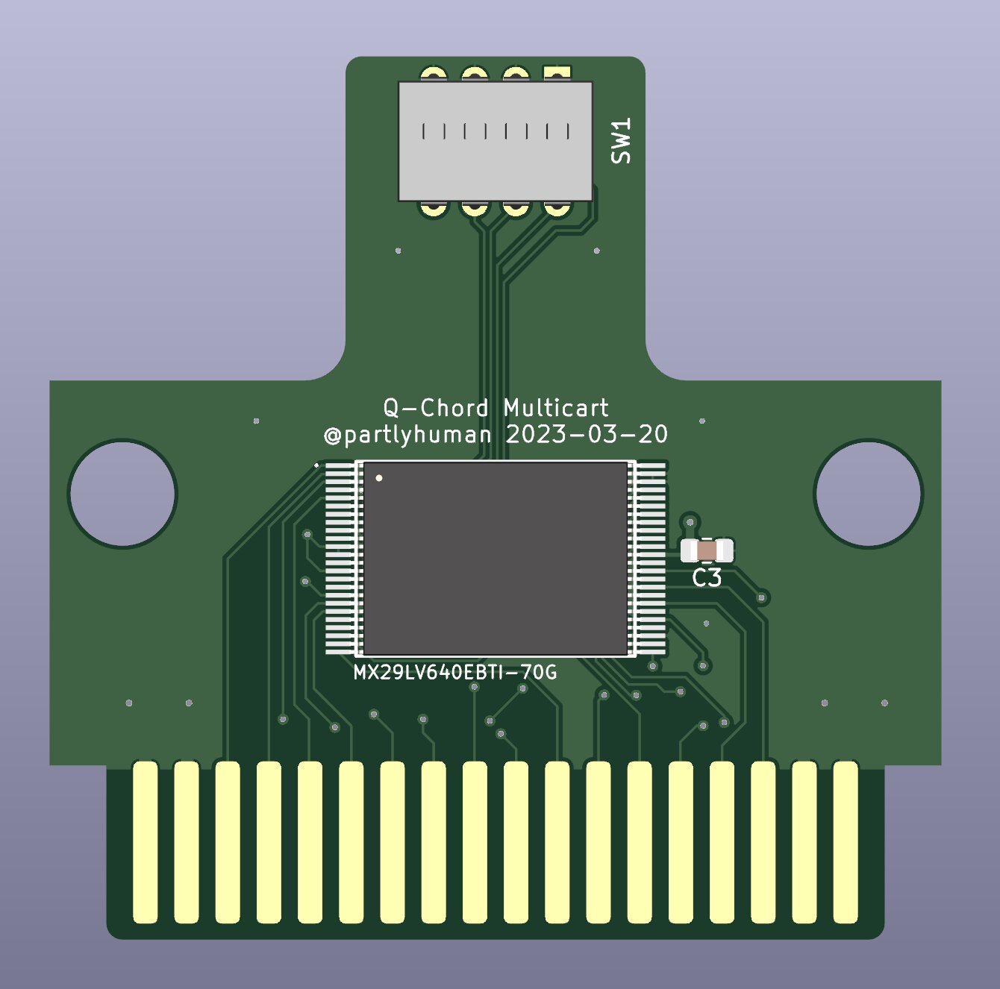
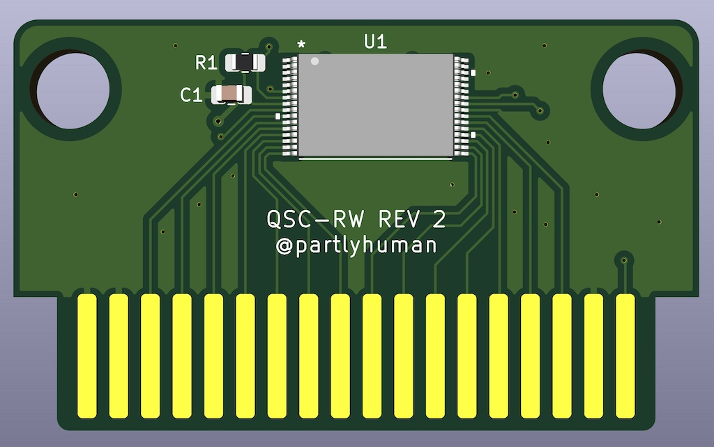

# Suzuki QChord Projects

Things that work with the Suzuki QChord, primarily a reproduction QCard that can be built with completely off-the-shelf parts.

# qcard-multicart

You can get one as long as stock lasts <a href="https://ko-fi.com/s/ca15ec594a">at my Ko-Fi shop!</a>
 

A single cartridge that contains the entire Q-Card library, selectable by dip switches. The flash should be programmed prior to assembly, by concatenating the 4Mbit dumps you can find on archive.org.

# qcard-single

A rewriteable reproduction QCard PCB using SMD components. The flash module uses a TSOP32 package. It can be reprogrammed after assembly with the programmer adapter below.

# qcard-case

3d printable cases for the flash QCard and multicart QCard. Prints easily with FDM printers.

BOM:

* 2x M3 screws

# qcard-programmer-pcb

A cartridge adapter to allow programming the reproduction QCard after assembly. Optional but highly suggested for ease of use.

BOM:

* 1x 36-pin (2x18) card connector slot, 2.54mm pitch
* 2x row of 16 header pins, 2.54mm pitch

To program a flash QCard:

* ensure JP1 is in the "program" position, that is, the middle and top segments are bridged by a solder blob
* insert the adapter in a TL866 programmer with the front as indicated by the outline on the adapter, and insert the QCard with the parts side up as indicated on the adapter
* program using XGPro with the SST39SF040-TSOP32 profile

# qcard-dumper-pcb

Optional unless you are going to dump QCards. Very similar to the programmer PCB.

To dump an original QCard:

* ensure that J401 is closed, J402 and J403 are open
* insert the adapter in a TL866 programmer with the front as indicated by the outline on the adapter, and insert the QCard with the parts side up as indicated on the adapter
* read using XGPro with the AT27C040 profile
* there may be one or in some cases two undetected pins, which you can safely ignore
