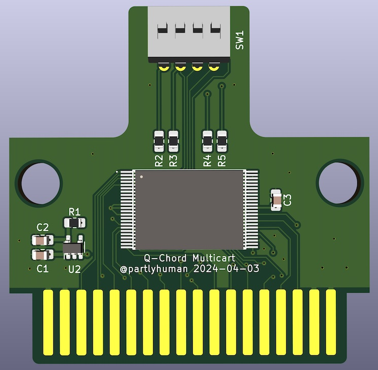
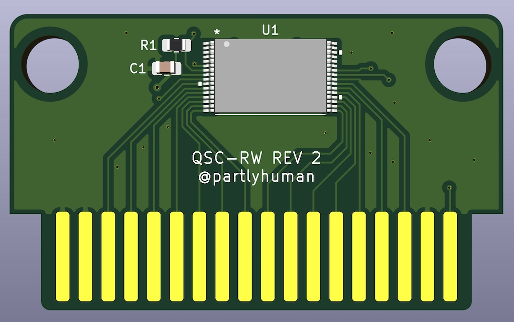

# Suzuki QChord Projects

Things that work with the Suzuki QChord, primarily a reproduction QCard that can be built with completely off-the-shelf parts. These projects are under active development.

# Physical devices

## [Q-Card Multicart QMC-001](pcbs/qcard-multicart)

You can get one as long as stock lasts <a href="https://ko-fi.com/s/ca15ec594a">at my Ko-Fi shop!</a>
 

A single cartridge that contains the entire Q-Card library, selectable by dip switches. The flash should be programmed prior to assembly, by concatenating the 4Mbit dumps you can find on archive.org.

## [Single Q-Card Reproduction](pcbs/qcard-single)

A rewriteable reproduction QCard PCB using SMD components. The flash module uses a TSOP32 package. It can be reprogrammed after assembly with the programmer adapter below.

# [Documentation](docs/)

Including 

* my research notes on the Q-Card hardware & connector
* my reverse-engineered Q-Card format
* continuing research into the sound bank present on Q-Chord

# [Software](software/)

Primarily, the `qcard` command-line tool that can be used to convert MIDI to and from Q-Cards.
