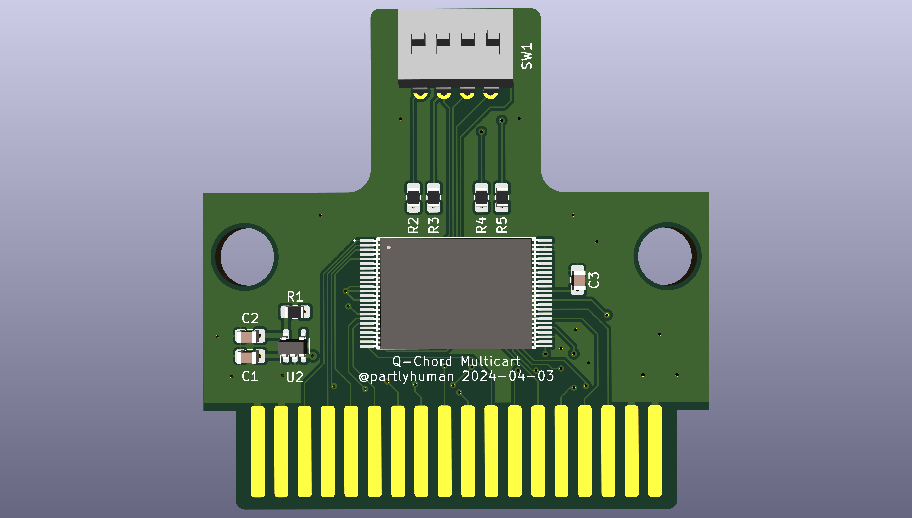
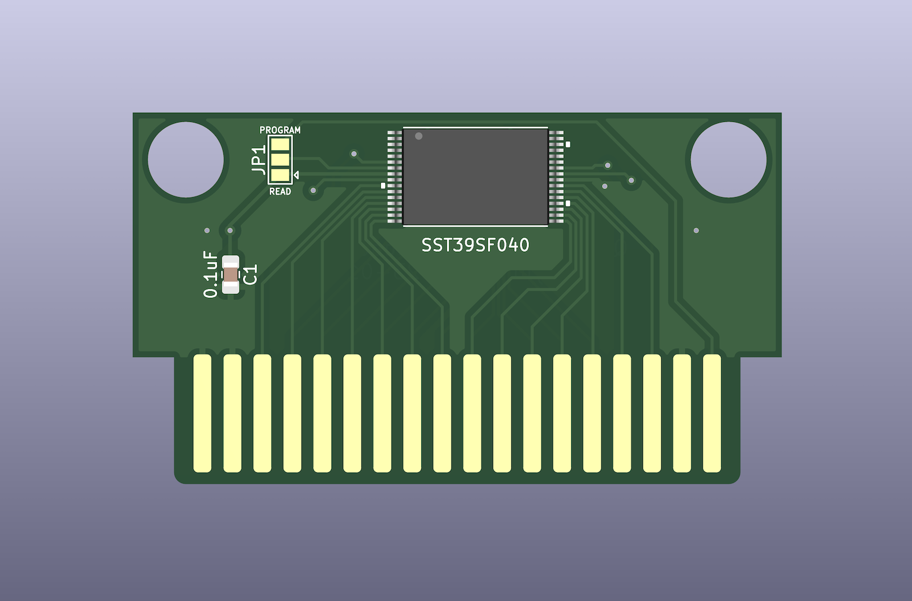
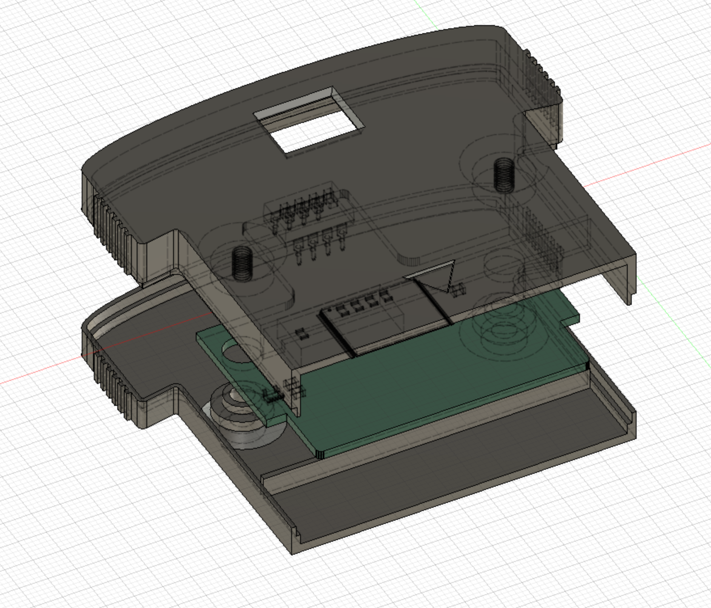

# Suzuki QChord Projects

Things that work with the Suzuki QChord, primarily a reproduction QCard that can be built with completely off-the-shelf parts.

# qcard-multicart

A single cartridge that contains the entire Q-Card library, selectable by dip switches. The flash should be programmed prior to assembly, by concatenating the 4Mbit dumps you can find on archive.org.

BOM:

* 1x MX29LV640ETTI parallel 3.3v 64mbit flash
* 1x MIC5365-3.3YD5 or similar 3.3v linear regulator in TSOT package
* 1x 76SB04ST or similar 4-row SPST DIP switch, 2.54mm pitch through-hole
* 2x 1uF 0805 SMD capacitor
* 1x 100pF 0805 SMD capacitor
* 4x 10K 0805 SMD resistor

# qcard-tsop32

A rewriteable reproduction QCard PCB using SMD components. The flash module uses a TSOP32 package. It can be reprogrammed after assembly with the programmer adapter below, and write-protected with a solder jumper

BOM:

* 1x SST39SF040 parallel 5v 4mbit flash
* 1x 0805 100pF SMD capacitor

# qcard-case

A 3d printable case for the flash QCard. Prints easily with FDM printers.

BOM:

* 2x M3 screws

# qcard-programmer-pcb

A cartridge adapter to allow programming the reproduction QCard after assembly. Optional but highly suggested for ease of use.

BOM:

* 1x 36-pin (2x18) card connector slot, 2.54mm pitch
* 2x row of 16 header pins, 2.54mm pitch

To program a flash QCard:

* ensure JP1 is in the "program" position, that is, the middle and top segments are bridged by a solder blob
* insert the adapter in a TL866 programmer with the front as indicated by the outline on the adapter, and insert the QCard with the parts side up as indicated on the adapter
* program using XGPro with the SST39SF040-TSOP32 profile

# qcard-dumper-pcb

Optional unless you are going to dump QCards. Very similar to the programmer PCB.

To dump an original QCard:

* ensure that J401 is closed, J402 and J403 are open
* insert the adapter in a TL866 programmer with the front as indicated by the outline on the adapter, and insert the QCard with the parts side up as indicated on the adapter
* read using XGPro with the AT27C040 profile
* there may be one or in some cases two undetected pins, which you can safely ignore