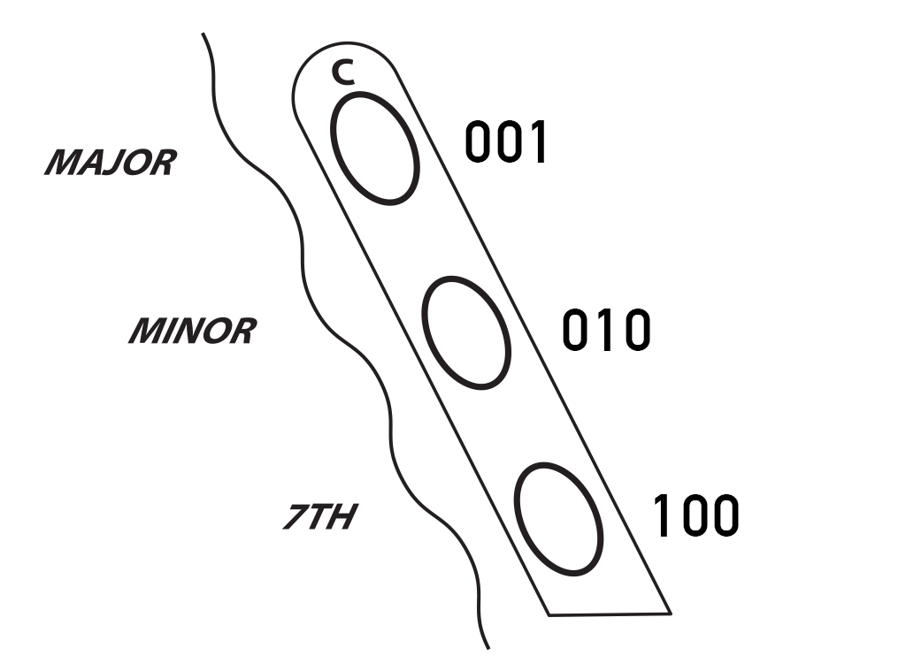

# Qcard documentation

Qcards contain MIDI data in a modified format. The following is an attempt to document them, as the product of reverse engineering work. There may be inaccuracies or omissions.

## Header

The header contains identifiers, some in preset fixed locations, and others (in variable length arrays) pointed to by these fixed locations. Data not in these special ranges is seemingly ignored, and there is no place for title, identifier, credits, etc.

| location | bytes | name          | type | description |
| -------- | ----  | ------        | ---- | ------------|
| `0005h`    | 1     | CART_TYPE     | `uint8_t` | which type of cart, `ROMPACK_SONG = 0x55` or `ROMPACK_RHYTHM = 0xAA` |
| `0010h`    | 1     | LAST_TRACK    | `uint8_t` | last track number (0-indexed), add one to get TRACKS, number of tracks |
| `0020h`    | 2     | DATA_POINTER  | `*(void*)[TRACKS]` | 2-byte pointer to array of 3-byte pointers to beginning of each track |
| `0022h`    | 2     | TEMPO_POINTER | `*uint8_t[TRACKS]` | 2-byte pointer to array of 1-byte tempos |
| `0024h`    | 2     | LENGTH_POINTER| `*uint8_t[TRACKS]` | 2-byte pointer to array of 1-byte time signatures | 
| `*LENGTH_POINTER` | 1 * TRACKS | LENGTHS | `uint8_t[TRACKS]` | array of time signatures (the length of a measure in ticks, where a quarter note is subdivided into 48 ticks): `SAMBUN_LENGTH = 0x90` for ³⁄₄ time (3 * 48 = 144 = 0x90), or `SABUN_LENGTH = 0xC0` for ⁴⁄₄ time (4 * 48 = 192 = 0xC0). |
| `*TEMPO_POINTER`  | 1 * TRACKS | TEMPOS  | `uint8_t[TRACKS]` | array of 1-byte tempos, as a clock divider, so that higher values are faster. In MIDI, µs per quarter note = `20000 * (TEMPO + 10)` |
| `*DATA_POINTER`   | 3 * TRACKS | DATAS   | `(void*)[TRACKS]` | array of 3-byte pointers to the start of each track |

While the pointer locations are ordered `DATA_POINTER`, `TEMPO_POINTER`, `LENGTH_POINTER`, the locations they point to are typically laid out in the reverse order, contiguous: `LENGTHS`, `TEMPOS`, `DATAS`. As they are two-byte pointers, please ensure that all values in the array fall within the first 0x10000 bytes of the Qcard.

Note that 2- and 3-byte pointers are read out big-endian, e.g. `00 26` is 0x0026.

The magic number `0x55` which identifies a song Qcard is coincidentally the same value reserved for Suzuki in MIDI's manufacturer IDs.

## Data

Song data are stored as a stream of MIDI events with the following special treatments:

*Delta time*. in MIDI files, the delta time occupies a variable number of bytes (1-4, usually 1) before every event. In Qcards, events that occur at the same time omit the zero delta time. The next event that occurs after a positive delta time must indicate this by preceding the delta time with an `FF` byte and then the positive delta time. In other words, we encode sequences of 1 or more events that happen simultaneously, each sequence starting in the delta-time since the previous sequence, as follows: delta time, first event, zero or more events that happen at the same time (without timestamps), `FF`. If each event in a sequence has a positive delta time, yes, `FF` is used between each of them. The `FF` should not be interpreted as MIDI data.

`10 EVENT1 EVENT2 EVENT3 FF 20 EVENT4 FF 30 EVENT5 FF`

In this example, 10 ticks elapse, then events 1-3 occur simultaneously, then 20 ticks elapse, event 4 occurs, 30 ticks elapse and then event 5.

*Running status* is used extensively. If an event is followed by another event of the same status, the status byte is not repeated. This is used in standard MIDI as well. When an `FF` is encountered, this ends the running status as well as the running zero  timestamp.

*Implicit note-off velocity*. In note-off events, such as `99 2A 00`, the second byte is the note and the third byte is the velocity. Frequently, this velocity is 0. In Qcards, when velocity is zero, that byte is omitted, as in `99 2A`.

Keep in mind these rules all combine. Here, the three zero timestamps are omitted, all the zero note-off velocities are omitted, and the running status of `99` is continued throughout the run.

| MIDI | QCard |
| ---- | ----- |
| `01 99 2A 00` `00 99 66 00` `00 99 24 00` `00 99 71 00` | `01 99 2A 66 24 71 FF` |

The song data are essentially comprised of MIDI transformed by these special rules.

## Special events

System messages and system real-time messages, including sysex and meta events, are illegal: any status starting with `F?` should not be included in Qcards.

*Qcard end-of-track* is indicated by `FE`. Typically this is included a number of times at the end of a track after a run end, such as `FF FE FE FE FE FE`.

*Metronome* flashing is triggered by a special event `B0 2C 7F`, nominally a controller change on channel 1, "effect control 1", value `01111111`.

*Chords* are encoded in MIDI as `AA` events, nominally polyphonic key pressure on channel 11. See below for chord bytes.

## Channels

Quite a few channels are reserved by the Qchord for various purposes. Therefore, these channels should be avoided when authoring Qcards, although it's possible you can stretch this.

Additionally, the channels are pre-assigned to be muted and activated by the "Auto Chord" and "Chord Plus" buttons.

| Channel | QCard  | Use | Notes |
| ------- | --------- | --- | ----- |
| 1  |   | MELODY KEYBOARD | Reserved for user playing on melody keyboard (piano mode). Metronome inserted on this channel (not audible).
| 2  |   | ??? | 
| 3  | 🆗 | CHORD PLUS | Song data, muted by "Chord Plus" button. Should be the main melody.
| 4  |   | ???
| 5  | 🆗 | AUTO CHORD 1 | Song data, muted by "Auto Chord" button. Should be accompaniment.
| 6  | 🆗 | AUTO CHORD 2 | Song data, muted by "Auto Chord" button. Should be accompaniment.
| 7  | 🆗 | AUTO CHORD 3 | Song data, muted by "Auto Chord" button. Should be accompaniment.
| 8  | 🆗 | AUTO CHORD 4 | Song data, muted by "Auto Chord" button. Should be accompaniment.
| 9  | 🆗 | BASS | Song data. Should be bassline.
| 10 | 🆗 | DRUMS | Song data. Drums should be on this channel.
| 11 |   | CHORD DATA | Reserved for chord data (not audible).
| 12 |   | ???
| 13 |   | ???
| 14 |   | STRUMPLATE | Reserved for user playing on strum bar.
| 15 |   | STRUMPLATE | Reserved for user playing on strum bar.
| 16 |   | STRUMPLATE | Reserved for user playing on strum bar.

I would consider channels 3, 5-10 as "safe mode." It's possible channels 2, 4, 12, 13 could also be used for song data.

## Tempo

The MIDI messages for tempo and time signature are not used by QCards, instead they are set in the header arrays. See above for some notes on conversion.

QChord uses a preset 48 parts per quarter note subdivision.

## Chords

The chords that you can play along with are encoded in the song data as `AA` key pressure events on channel 11. In Qcards, the first byte is always `AA`, the second byte represents the chord, and the third byte is `00`. The chord byte can be further split into two nibbles:

The *Chord quality* is represented by the upper digit 1-7. It's easiest to visualize these as the result of holding down the chord buttons. There are three rows of buttons on the Qchord, represented by the three bits. The top row, major chords, is the least significant bit `1`; the middle row, minor chords, the second bit `10`; the bottom row, 7th chords, is the most significant bit `100`:

| nibble | 7th | Min | Maj | Result |
|-------|---|---|---|--------------|
| **1** | 0 | 0 | 1 | Major        |
| **2** | 0 | 1 | 0 | Minor        |
| **3** | 0 | 1 | 1 | Diminished   |
| **4** | 1 | 0 | 0 | 7th          |
| **5** | 1 | 0 | 1 | Major 7th    |
| **6** | 1 | 1 | 0 | Minor 7th    |
| **7** | 1 | 1 | 1 | Augmented    |

The *Root note* is represented by the lower digit 0-B.

| **nibble** | 0 | 1 | 2 | 3 | 4 | 5 | 6 | 7 | 8 | 9 | A | B |
|------------|---|---|---|---|---|---|---|---|---|---|---|---|
| **note**   | C | D♭| D | E♭| E | F | F♯| G | A♭| A | B♭| B |

Therefore, the byte `10` is CMaj, the byte `29` is Amin, etc. Again, the full events would be `AA 10 00` and `AA 29 00`.

## Reference implementation

You can use the `qcard2midi` and `midi2qcard` software as reference implementations. See the source [here](https://github.com/partlyhuman/qchord/tree/master/qcard-tools/MidiQcard/Partlyhuman.Qchord.Common).
